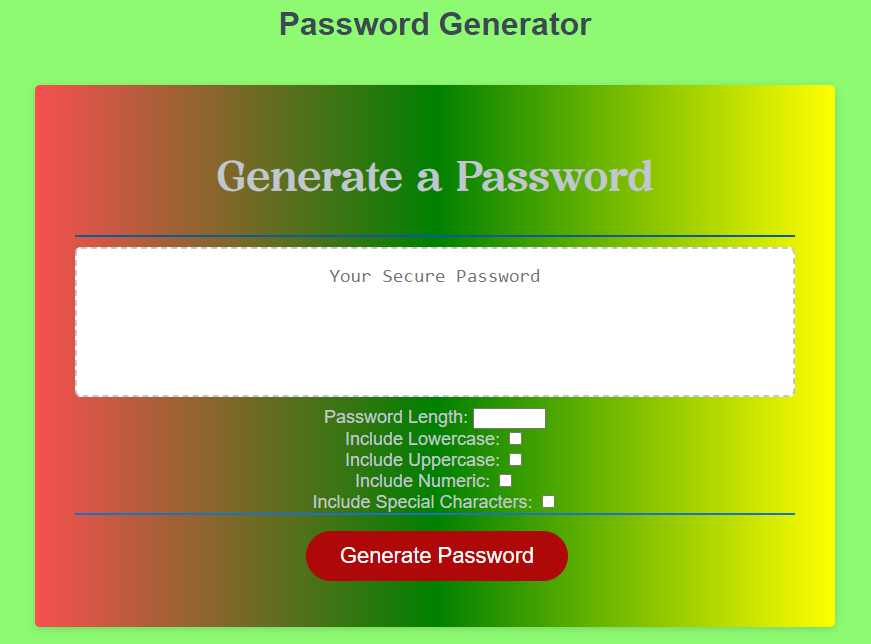
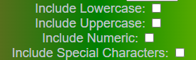

# Password Generator App

App Link:  https://ramonsaguini.github.io/passwordGenerator/

     This App is an automatic password generator is a tool designed 
     to create secure passwords randomly, enhancing resistance 
     against cyber attacks. These passwords typically include a 
     combination of uppercase and lowercase letters, numbers, 
     and special characters. 

 
       
   

## Here's a general description of how an automatic password generator works:

* Randomness: The generator uses an algorithm to produce sequences 
of characters randomly. This increases the complexity of passwords, 
making them less predictable.

* Customizable Length: Users can usually specify the desired length 
for their passwords. Longer passwords generally offer increased security.

       
   

* Inclusion of Various Characters: Generated passwords may include 
uppercase and lowercase letters, numbers, and special characters. 
This diversifies the elements of the password, making it more robust 
against brute-force attacks.

       
   

* Avoidance of Predictable Patterns: The generator is designed to avoid 
common patterns, such as simple numerical sequences (123456) or words 
found in dictionaries.

* Secure Usage: The tool is implemented in secure environments to ensure 
that passwords are generated and delivered securely, without undue exposure 
to third parties.

* Ease of Use: The user interface is typically designed to be intuitive, 
allowing users to customize settings and easily copy the generated 
passwords for immediate use.

      Remember that even with strong passwords, additional practices such 
      as two-factor authentication are important to reinforce the security 
      of online accounts. The automatic password generator is a valuable 
      tool to help users create robust passwords and protect their personal 
      information online
